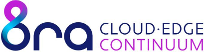

## Welcome to the team 🙌

# Adeptic Reply | Projects

This repository contains all information thematically related to **Adeptic Reply**. Project guidelines, technical proposals (RFCs), and governance documentation are all part of this repository.

## 🚀 Who We Are
**Adeptic Reply** is a company within the **Reply S.p.A.** group focused on the research, development, and implementation of advanced solutions in the field of next-generation Cloud and Edge infrastructures.

Our primary objective is to represent technological excellence within the **IPCEI CIS** (Important Project of Common European Interest - Cloud Infrastructure and Services) project, a strategic European initiative aimed at building a sovereign and resilient data infrastructure.

Link to the Reply project on the 8RA website: https://www.8ra.com/projects/cloud-computing-edge-for-data-network-service-over-fttx-oran-and-asp4agv

  
<strong>Reply for IPCEI-CIS</strong>

  ### Finanziamento

  Questo progetto è stato finanziato con Fondo IPCEI – interv. Infrastrutture e Servizi Cloud CIS 
  D.M. di attivazione 27/06/2022; D.D. di apertura 23/02/2024 
  Beneficiario REPLY S.p.A (C.F. 97579210010) 
  Prog. N. SA.102519 - D.D. n. 1676 del 14/10/2024 
  CUP B19J24000950005; Progetto n. IPCEI-CL_0000004. 
  https://www.mimit.gov.it/it/incentivi/ipcei-infrastrutture-e-servizi-cloud-cis

  ### Disseminazione

  Nell’ambito delle attività di diffusione e promozione del progetto elenchiamo qui alcune delle partecipazioni attive di Reply in iniziative nazionali e europee: https://www.reply.com/adeptic-reply/en/newsroom

## 🇪🇺 IPCEI CIS Mission
Our contribution focuses on creating a software framework capable of enabling the federation of cloud and edge services. We work to:
- Ensure interoperability between different European providers.
- Develop open-source technologies that support digital sovereignty.
- Optimize workload distribution from the data center to the edge device.

  &emsp;&emsp;
  &emsp;&emsp;
  &emsp;&emsp;

© 2026 [Adeptic Reply](https://www.reply.com/adeptic-reply/en/about-us) - A [Reply](https://www.reply.com) Group Company
